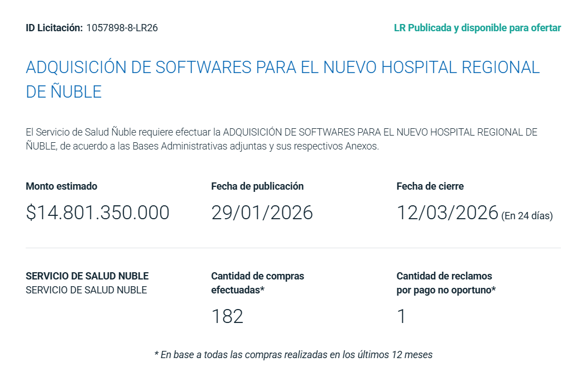

# Licitación Software Hospital de Ñuble: $14.801 Millones Sin Análisis de Costo Real

## Comunicado de Prensa

**Santiago, Chile** — El Servicio de Salud Ñuble ha publicado la licitación ID **1057898-8-LR26** para la "Adquisición de Softwares para el Nuevo Hospital Regional de Ñuble" por un monto estimado de **$14.801.350.000** (catorce mil ochocientos un millones de pesos chilenos).

### Datos Técnicos de la Licitación

- **Monto estimado:** $14.801.350.000 CLP
- **Fecha de publicación:** 29/01/2026
- **Fecha de cierre:** 12/03/2026 (24 días)
- **Cantidad de compras efectuadas:** 182 (últimos 12 meses)
- **Estado:** LR Publicada y disponible para ofertar

### Falta de Transparencia en Costos

Esta adquisición plantea serias interrogantes sobre la evaluación técnica y económica del gasto público en software hospitalario:

1. **Sin desglose técnico público**: La licitación no especifica públicamente qué sistemas específicos justifican los $14.801 millones
2. **Sin benchmarking internacional**: No hay comparación con costos de sistemas equivalentes en hospitales de países OCDE
3. **Sin análisis de alternativas**: No se evidencia evaluación de soluciones open-source o licenciamiento modular
4. **Sin proyección de costos de mantención**: Los costos operativos post-implementación permanecen ocultos

### Contexto: ¿En Qué Más Se Podría Invertir?

Para dimensionar la magnitud de esta inversión en software, con $14.801 millones se podría financiar:

| Alternativa | Costo Unitario | Cantidad Posible |
|------------|----------------|------------------|
| **CESFAM Grande** | $9.800.000.000 | 1,5 centros de salud |
| **CESFAM Standard** | $6.400.000.000 | 2,3 centros de salud |
| **Cirugías** | $1.450.000 | 10.208 cirugías |
| **Déficit Salud Tarapacá** | $14.000.000.000 | 105,7% del déficit cubierto |
| **Máquinas de Resonancia Magnética** | $1.500.000.000 | 10 equipos MRI |
| **Atención per cápita** | $11.205 | 1.320.959 pacientes atendidos |

**[Ver visualización interactiva completa →](hospital-software-cost.html)**

### Precedentes Internacionales de Fracasos

La industria del software hospitalario tiene un historial documentado de sobrecostos y fracasos:

- **UK NHS National Programme for IT (2002-2011)**: £10 mil millones gastados, proyecto cancelado
- **Queensland Health Payroll System, Australia (2010)**: AU$1.200 millones de sobrecosto
- **Epic Systems, múltiples hospitales USA**: Sobrecostos rutinarios del 30-50% sobre estimación inicial

### Preguntas Técnicas

1. ¿Qué porcentaje corresponde a licencias vs. servicios profesionales vs. hardware?
2. ¿Se evaluaron arquitecturas basadas en estándares abiertos (HL7 FHIR, DICOM)?
3. ¿Cuál es el TCO (Total Cost of Ownership) a 10 años?
4. ¿Qué garantías existen contra vendor lock-in?
5. ¿Se consideraron soluciones hospitalarias exitosas de escala similar en América Latina?

### Llamado

Hacemos un llamado a:

- **Autoridades de Salud Ñuble**: Publicar análisis técnico-económico detallado que justifique el monto
- **Contraloría General**: Auditar metodología de estimación de costos antes de adjudicación
- **Comisión de Salud del Congreso**: Solicitar comparecencia para explicar criterios técnicos
- **Ciudadanía**: Exigir transparencia en uso de recursos públicos destinados a tecnología

### Recursos

- **Visualización interactiva**: [hospital-software-cost.html](hospital-software-cost.html)
- **ID Licitación**: 1057898-8-LR26
- **Portal Mercado Público**: [Enlace directo a licitación](https://www.mercadopublico.cl/Procurement/Modules/RFB/DetailsAcquisition.aspx?idlicitacion=1057898-8-LR26)

---

**Contacto de prensa:**  
Este análisis está disponible públicamente en formato web interactivo y datos abiertos.

**Nota técnica:**  
Los costos de referencia provienen de presupuestos públicos del Ministerio de Salud de Chile y licitaciones comparables en el sistema de Mercado Público.

---

*Última actualización: Febrero 2026*